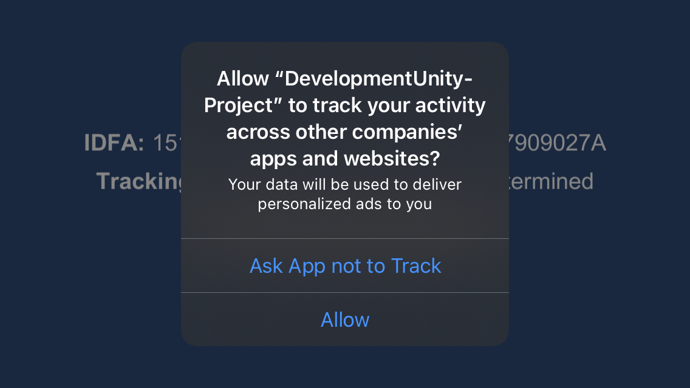
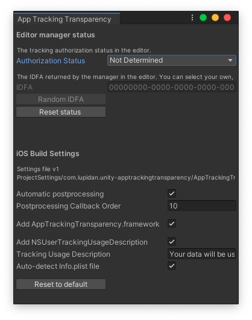
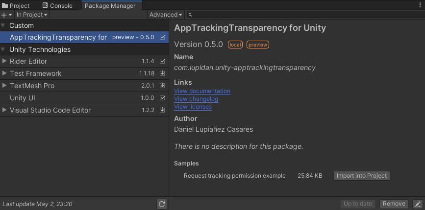

# App Tracking Transparency for Unity Plugin

## Overview
This repository contains a plugin to support the App Tracking Transparency framework for iOS in Unity 3D.

Introduced on iOS 14.0, Apple wants all developers that want to retrieve the IDFA for a user, to ask permission for it. If the user does not provide permission, an anonymous IDFA is provided instead (`00000000-0000-0000-0000-000000000000`)

Starting from iOS 14.0, the API was made available for developers, but the restriction was not applied yet.

Starting from iOS 14.5, Apple started enforcing this rule, so all users have to give their permission to obtain the IDFA.



This plugin supports the following platforms:
* **iOS**
* **tvOS** (Experimental)


## Features
- Support for iOS
- Support for tvOS (Experimental)
- Support to get the current App Tracking Transparency Status to get the IDFA
- Support to request authorization for the IDFA
- Editor implementation for the feature, imitating the native implementation.
- Configurable automatic postprocessing, add required frameworks and required Info.plist entries


## Installation

> Current version is v0.6.0

Here is a list of available options to install the plugin

### Unity Package Manager with Git URL

Just add this line to the `Packages/manifest.json` file of your Unity Project:

```json
"dependencies": {
    "com.lupidan.unity-apptrackingtransparency": "https://github.com/lupidan/unity-apptrackingtransparency.git?path=/com.lupidan.unity-apptrackingtransparency#v0.6.0"
}
```

### Unity Package File
1. Download the most recent Unity package release [here](https://github.com/lupidan/unity-apptrackingtransparency/releases)
2. Import the downloaded Unity package in your app.


## Implementing the AppTrackingTransparency code 

### Setup the manager
To setup the plugin, you need to:
1) Create the manager
2) Update it in an Update method or similar update loop.

You can create and update the component in a MonoBehaviour of your choice. The MonoBehaviour can be a dedicated one, just for this manager, or a MonoBehaviour containing other managers.

**Calling Update is required** if you want to receive any asynchronous callbacks to be handled correctly inside Unity's update loop.

```
using AppTrackingTransparency;
using AppTrackingTransparency.Common;

...

public AppTrackingTransparencyHandler : MonoBehaviour
{
    public IAppTrackingTransparencyManager AppTrackingTransparencyManager;

    private void Start()
    {
        if (AppTrackingTransparencyModule.IsSupported)
        {
            this.AppTrackingTransparencyManager = AppTrackingTransparencyModule.CreateManager();
        }
    }

    private void Update()
    {
        if (this.AppTrackingTransparencyManager != null)
        {
            this.AppTrackingTransparencyManager.Update();
        }
    }
}
```

### Get the current tracking authorization status
Initially, the value is not determined. After requesting authorization, it becomes either Denied or Authorized.

```
this.AppTrackingTransparencyManager.TrackingAuthorizationStatus;
```

### Get the IDFA
Starting from iOS 14.5, if the status is Authorized, you should get the user's IDFA. Otherwise, you should get an anonymous IDFA (`00000000-0000-0000-0000-000000000000`)
In previous iOS versions you should get the user's IDFA.
```
this.AppTrackingTransparencyManager.Idfa;
```

### Request tracking authorization
You should request permission when the tracking authorization status is not determined.
> :warning: The callback won't execute if you are not calling Update on the AppTrackingTransparencyManager. **Make sure you are periodically calling Update on it**.

```
this.AppTrackingTransparencyManager.RequestTrackingAuthorization(authStatus =>
{
    Debug.Log("Authorization status changed: " + authStatus);
});
```

## Plugin configuration

To access the plugin configuration just go to the menu present in **Assets -> AppTrackingTransparency -> Configuration** You should see a window like this:



### Editor manager status
In this section you can control the current status of the editor implementation for the plugin.

- *Authorization Status*: Current authorization status returned by the editor implementation
- *IDFA*: Current IDFA value returned by the editor implementation when the status is Authorized.
- *Random IDFA*: Generates a new random IDFA value
- *Reset status*: Completely reset the status of the editor implementation, simulating the status after a fresh app install.

### iOS Build settings

The plugin offers automated options for post-processing on iOS.
> The settings file is located in: 
>  "ProjectSettings/com.lupidan.unity-apptrackingtransparency/AppTrackingTransparencySettings.json"
> This is a file you will want to commit to your repository, to keep your plugin configuration.

This section allow you to configure what parts of the automatic post-processing you want to have for your project.
- *Automatic postprocessing*: If enabled the automatic postprocessing for iOS will be run. If disabled, it will be completely ignored.
- *Postprocessing Callback Order*: The order in which the postprocessing will be run. You can change the number so it works along other postprocessing scripts you may have in your project. The default value is 10.
- *Add AppTrackingTransparency.framework*: If enabled, the automatic post-processing will automatically add the AppTrackingTrasnparency.framework as optional for compatibility with previous iOS versions.
- *Add NSUserTrackingUsageDescription*: If enabled, the automatic post-processing will automatically add the required description to be displayed when requesting permission to the user.
- *Tracking Usage Description*: String of text to be added as NSUserTrackingUsageDescription so it's displayed to the user when requesting permission.
- *Auto-detect Info.plist file*: The NSUserTrackingUsageDescription value needs to be added to the main target's `Info.plist` file. When enabled, the auto post-processing will detect the current file and add the value in it. If disabled, you will have the option to specify the relative path for the `Info.plist` file you want to modify.

## Any code samples?
There is a [folder](https://github.com/lupidan/unity-apptrackingtransparency/tree/main/com.lupidan.unity-apptrackingtransparency/Samples%7E) inside the plugin code containing some samples.
You can also import the sample code into your project by going to the Unity Package Manager, selecting the packages In Project, and selecting the AppTrackingTransparency for Unity package. You should see an option to import a sample:


